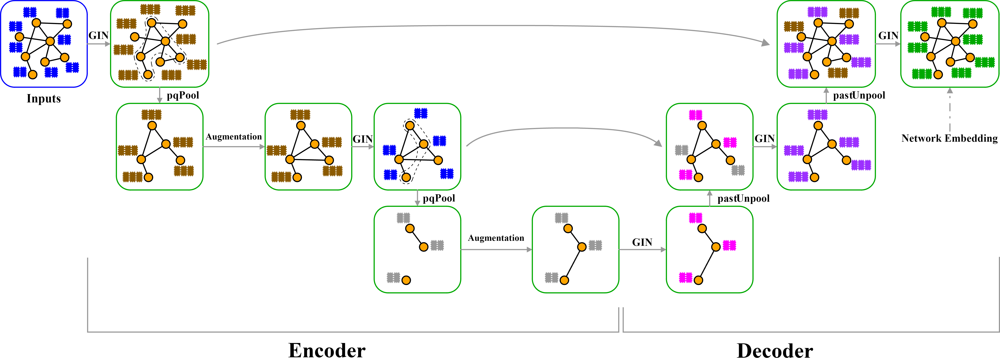
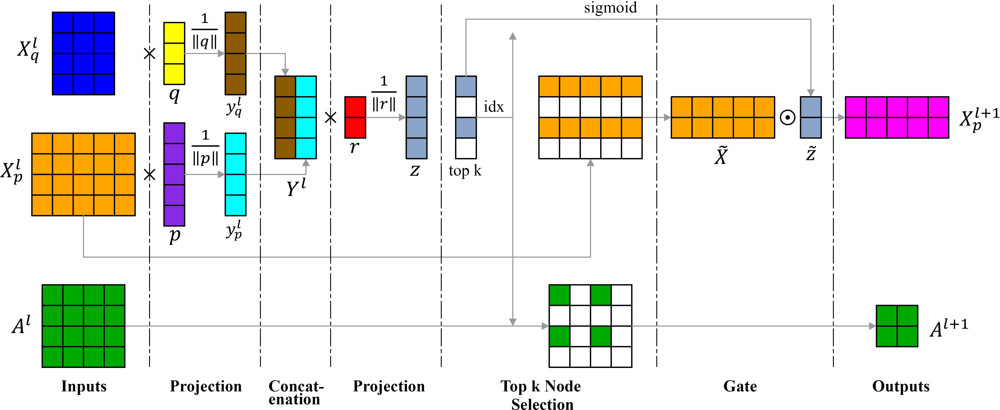

# Graph Isomorphism UNet

## Description

This is a contemporary PyTorch implementation for the task of graph classification using graph neural networks (GNN). It is built mainly upon the GIN (Graph Isomorphisms Networks) approach and includes some novel models introduced in the paper titled "Graph Isomorphism UNet," authored by Alireza Amouzad, Zahra Dehghanian, Saeed Saravani, Maryam Amirmazlaghani, and Behnam Roshanfekr, affiliated with Amirkabir University of Technology.
The link of paper:
[Link text Here](https://link-url-here.org](https://doi.org/10.1016/j.eswa.2023.121280)

## Table of Contents

- [Usage](#usage)
- [Method](#method)
- [Details](#details)
- [Installing](#installing)

## Usage

This repository serves as a pipeline for training and evaluating graph neural network models on graph classification tasks using graph isomorphism networks (GIN). An overview of what this project accomplishes is provided below:

## Method

Complete novel method is introduced in paper. The model's architecture and pooling method is as follows:

### GIUNet Structure



### pqPool



To learn more about the design of pqPool in the spectral and centrality regime, please refer to the accompanying paper for additional information.

## Details

### Data Loading and Preprocessing

Graph datasets (MUTAG, ENZYMES, PROTEINS) are loaded using PyTorch Geometric's TUDataset. Subsequently, the datasets are divided into training and test sets, and data loaders are created for batch processing.

### Model Definition

Several graph neural network models have been defined, including:

- GINModel
- SimpleGraphUNet
- GraphUNetTopK
- GIUNetSpect
- GIUNetCent

First three models are rapid performing models that their results are impressive, and last two novel models are proposed by authors.

These models utilize PyTorch Geometric's GINConv, TopKPooling, global pooling, and custom pooling layers.

### Training and Testing

The models are trained and tested for 300 epochs. During the training phase, the loss is computed, and model parameters are updated. Training and testing accuracy and loss are monitored over the course of epochs.

### Logging

Training and testing metrics, including loss and accuracy, are recorded over each epoch and saved to CSV files.

### Visualization

Scripts for visualizing training and testing metrics using matplotlib have been developed. Separate plots for accuracy and loss are generated for each dataset and model combination.

### Embedding Visualization

Code for visualizing the embeddings learned by the models using t-SNE is available. The dimensionality of embeddings is reduced to either 2D or 3D, and they are visualized along with their labels.

### Model Saving

The state_dict of the best-performing model is saved to disk for subsequent use or evaluation.

Overall, this code is regarded as clear and well-documented, following best practices for organizing machine learning experiments.

## Installing

To run this project, you need to install the Python packages mentioned in `requirements.txt`. To install the dependencies listed in `requirements.txt`, open a command prompt or terminal, navigate to your project directory, and run the following command:

```bash
pip install -r requirements.txt
